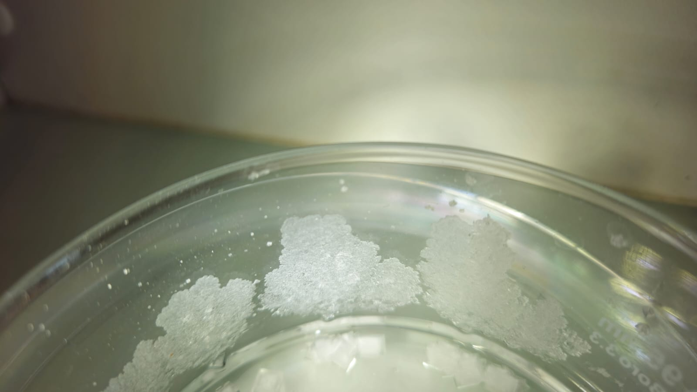
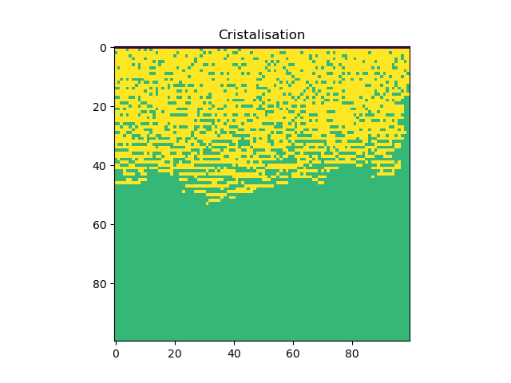
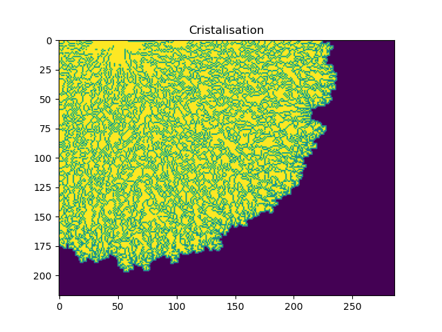

# Salt creeping

## Premier code de cristallisation

### Objectif, méthode et hypothèses

L'objectif de ce premier code est de simuler la cristallisation en supposant qu'à chaque pas de temps un certain nombre d'ions doit se critalliser. Pour cela, on se place sur une grille (objet avec une matrice de case...). Sur cette grille chaque case (objet avec un type...) possède un type : 

- -2 représente le solide sur lequel les cristaux se forment.
- -1 représente l'air (pas encore utilisé dans cette version, on suppose qu'il y a de l'eau de partout pour l'instant)
- 0 représente l'eau
- Un entier strictement positif représente un des cristaux.

Une première passe de la grille permet de déterminer où les prochains NaCl peuvent se former. Pour cela on fixe les règles suivantes : 

- Si la case est à plus de 2 cases de tout solide la cristallisation ne peut pas se produire.
- Si la case est à une case de distance d'un cristal elle peut former un nouveau cristal.
- Si la case est en contact avec un cristal déjà existant, elle peut le prolonger. 

On ne donne pas la probabilité qu'une case est un cristal directement. On estime plutot le nombre de case où peuvent se former les critaux et on fait le rapport avec le nombre de cistaux disponible. La seul donné importante devient la probabilité qu'un nouveau cristal se forme par rapport à ce qu'un cristal se prolonge simplement.

### Résultats

### Discussion
On observe que dans l'expérience les cristaux grossisent en faisant des genre d'arbres. En revanche, sur la simulation, les cristaux augmentes en paté.

Afin de se rapprocher de la réalité, il semble important de changer la coupe faite. Il faudrait aussi prendre en compte l'air. En effet, sur l'expérience, l'air vient clairrement attirer le cristallisation changeant sa dynamique.

## Deuxième version, prise en compte de l'air

### Objectif et méthodes

A la suite du code précédent, on s'est rendue compte que pour avoir une forme plus proche de la réalité, il fallait prendre en compte la présence de l'air. Pour cela, on rajoute deux choses à la version précédente : 
- Si une case est proche d'un cristal et d'une case d'air, on augmente la probabilité de cristallisation (en augmentant artifficiellement le nombre de voisin).

- A chaque nouveau cristau, on s'assure que l'eau remonte d'un cran (pas de modèle de capilarité).

### Résultats

### Discussion

On observe que l'on est déjà plus proche de l'expérience. On voit le point de départ de la cristallisation et la diffusion assez clairement. Cependant cela est loin d'être parfait. Les cristaux n'on pas encore la bonne forme, on a pas d'échelle (ni pour le pas de temps ni pour le pas d'espace)...

De plus, les critères précédent sont très arbitraires pour caractériser la ressemblance à la réalité. Ils semblent donc qu'il y ait maintenant deux pistes à suivre : 

- Trouver des modèles physiques pour les différentes probabilités afin d'obtenir un modèle plus cohérent. Cela devrait dans le même temps donner les échelles à avoir pour la modélisation.

- Trouver des critères plus objectifs pour s'assurer de la ressemblance du milieu (simension fractal pour caractériser la porosité...).